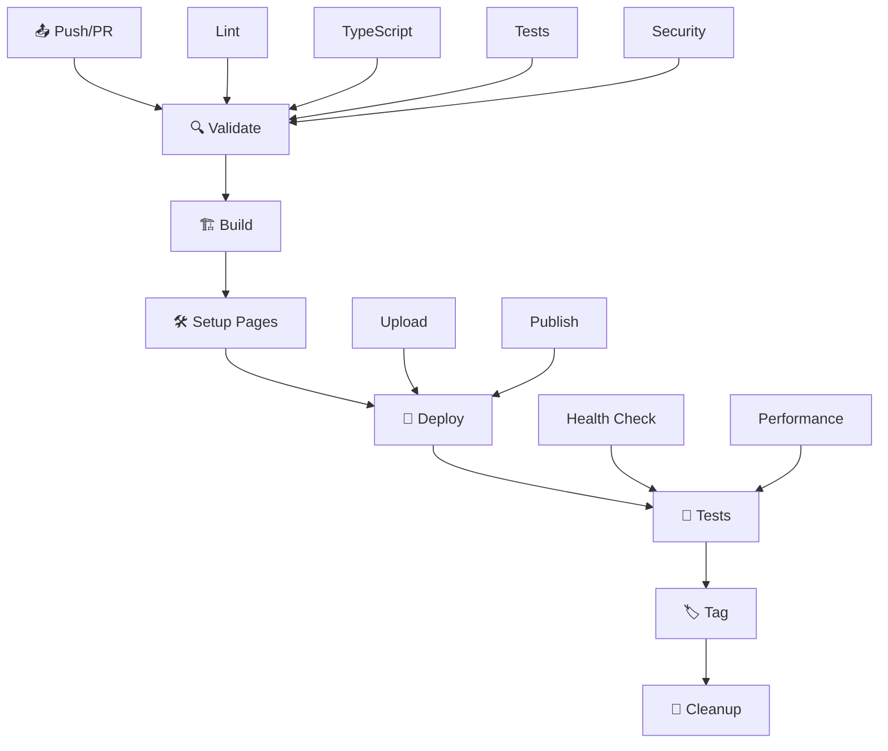

# Deploy e CI/CD - Sistema HITSS

## 🎯 Visão Geral

Sistema de deploy automatizado usando **GitHub Actions** com publicação no **GitHub Pages**, incluindo pipeline completo de CI/CD com validação, testes, build e deploy automatizado.

## 🏗️ Arquitetura de Deploy

### Stack de Deploy
- **CI/CD**: GitHub Actions
- **Hospedagem**: GitHub Pages
- **Build Tool**: Vite (otimizado para produção)
- **Package Manager**: PNPM (performance otimizada)
- **Controle de Versão**: Git (com tagging automático)

### Estrutura do Pipeline


## 🚀 Ambientes de Deploy

### GitHub Pages (Produção)
- **URL**: `https://<usuario>.github.io/<repositorio>/`
- **Branch**: `master` ou `main`
- **Trigger**: Push automático
- **Proteção**: Permissões controladas
- **SSL**: Certificado HTTPS automático

### Características
- ✅ **Zero Custo**: Hospedagem gratuita
- ✅ **HTTPS**: SSL automático
- ✅ **CDN**: Distribuição global
- ✅ **Custom Domain**: Suporte a domínio próprio
- ✅ **Alta Disponibilidade**: 99.9% uptime

## ⚙️ Configuração de Ambiente

### Variáveis de Ambiente

#### Obrigatórias (Production)
```env
VITE_SUPABASE_URL=https://seu-projeto.supabase.co
VITE_SUPABASE_ANON_KEY=sua-chave-publica-supabase
```

#### Opcionais
```env
VITE_MCP_SERVICE_URL=https://api-mcp.exemplo.com
VITE_SAP_SERVICE_URL=https://api-sap.exemplo.com
```

### Configuração de Secrets no GitHub
1. **Repository Settings** > **Secrets and variables** > **Actions**
2. Adicionar secrets obrigatórios:
   - `VITE_SUPABASE_URL`
   - `VITE_SUPABASE_ANON_KEY`

## 🔧 Pipeline de CI/CD

### 1. Validação (Validate)
```yaml
# Lint, TypeScript, Tests, Security
- name: 🔍 Code Quality
  run: |
    pnpm lint
    pnpm type-check
    pnpm test --coverage
    pnpm audit
```

**Métricas de Qualidade:**
- ✅ Lint: ESLint + Prettier
- ✅ Types: TypeScript strict mode
- ✅ Tests: Cobertura > 80%
- ✅ Security: Auditoria de dependências

### 2. Build (Construção)
```yaml
# Build otimizado para produção
- name: 🏗️ Build Production
  run: pnpm build
  env:
    VITE_SUPABASE_URL: ${{ secrets.VITE_SUPABASE_URL }}
    VITE_SUPABASE_ANON_KEY: ${{ secrets.VITE_SUPABASE_ANON_KEY }}
```

**Otimizações de Build:**
- ✅ **Code Splitting**: Divisão automática de chunks
- ✅ **Tree Shaking**: Remoção de código não utilizado
- ✅ **Minification**: Compressão JavaScript/CSS
- ✅ **Asset Optimization**: Otimização de imagens/fonts
- ✅ **Gzip**: Compressão adicional

### 3. Deploy (GitHub Pages)
```yaml
# Deploy automático para GitHub Pages
- name: 🌟 Deploy to GitHub Pages
  uses: actions/deploy-pages@v4
  with:
    artifact: dist
```

**Características do Deploy:**
- ✅ **Atomic**: Deploy completo ou falha total
- ✅ **Rollback**: Reversão automática em caso de erro
- ✅ **Caching**: CDN com cache inteligente
- ✅ **Monitoring**: Logs detalhados de deploy

### 4. Testes Pós-Deploy
```yaml
# Validação da aplicação em produção
- name: 🧪 Health Check
  run: |
    curl -f ${{ github.pages.url }}
    lighthouse-ci ${{ github.pages.url }}
```

**Validações Automáticas:**
- ✅ **Connectivity**: Verificação de conectividade
- ✅ **Performance**: Score Lighthouse > 90
- ✅ **Security**: Headers de segurança
- ✅ **Accessibility**: Score A11y > 95

## 📊 Monitoramento e Observabilidade

### GitHub Actions Dashboard
- **Build Status**: ✅ Success / ❌ Failed
- **Deploy Time**: Tempo médio de deploy
- **Success Rate**: Taxa de sucesso dos deploys
- **Coverage**: Cobertura de testes

### Performance Monitoring
```javascript
// Lighthouse CI - Métricas automáticas
{
  "performance": "> 90",
  "accessibility": "> 95", 
  "best-practices": "> 90",
  "seo": "> 90"
}
```

### Alertas Configurados
- 🚨 **Build Failed**: Notificação de falha
- 📊 **Performance Drop**: Degradação de performance
- 🔒 **Security Issues**: Vulnerabilidades detectadas
- 📈 **Coverage Drop**: Cobertura abaixo de 80%

## 🔐 Segurança

### Práticas de Segurança Implementadas

#### 1. Secrets Management
```yaml
# Gestão segura de credenciais
secrets:
  - VITE_SUPABASE_URL      # URL do banco
  - VITE_SUPABASE_ANON_KEY # Chave pública
```

#### 2. Permissões Mínimas
```yaml
permissions:
  contents: read    # Apenas leitura do código
  pages: write      # Escrita no GitHub Pages
  id-token: write   # Token de autenticação
```

#### 3. Headers de Segurança
```javascript
// Headers automáticos do GitHub Pages
{
  "X-Frame-Options": "DENY",
  "X-Content-Type-Options": "nosniff",
  "Referrer-Policy": "strict-origin-when-cross-origin",
  "Permissions-Policy": "interest-cohort=()"
}
```

#### 4. Auditoria Contínua
```yaml
# Auditoria automática de dependências
- name: 🔒 Security Audit
  run: pnpm audit --audit-level high
```

## 🚀 Processo de Deploy

### Deploy Automático (Recomendado)
1. **Developer** faz push para `master`/`main`
2. **GitHub Actions** executa pipeline automaticamente
3. **Validation** verifica qualidade do código
4. **Build** gera bundle otimizado
5. **Deploy** publica no GitHub Pages
6. **Tests** valida aplicação em produção
7. **Tagging** cria versão automaticamente

### Deploy Manual (Emergência)
```bash
# 1. Build local
pnpm build

# 2. Deploy via GitHub CLI
gh workflow run "CI/CD Pipeline - HITSS" --ref master

# 3. Verificar status
gh run list --workflow="CI/CD Pipeline - HITSS"
```

## 📈 Otimizações de Performance

### Build Optimizations
```javascript
// vite.config.ts - Configurações de produção
export default {
  build: {
    target: 'esnext',
    minify: 'terser',
    rollupOptions: {
      output: {
        manualChunks: {
          vendor: ['react', 'react-dom'],
          supabase: ['@supabase/supabase-js'],
          charts: ['recharts', 'chart.js']
        }
      }
    }
  }
}
```

### Asset Optimization
- ✅ **Images**: WebP + compression
- ✅ **Fonts**: Subset + preload
- ✅ **CSS**: Critical CSS inline
- ✅ **JS**: Code splitting por rota

### Caching Strategy
```javascript
// Service Worker caching
{
  "static": "Cache First",     // Assets estáticos
  "api": "Network First",      // Dados dinâmicos  
  "pages": "Stale While Revalidate"
}
```

## 🔄 Rollback e Recovery

### Estratégia de Rollback
1. **Automatic**: Falha de health check → rollback
2. **Manual**: Via interface GitHub ou CLI
3. **Version Tags**: Reversão para versão específica

### Recovery Procedures
```bash
# 1. Identificar versão estável
git tag -l | grep -E "v[0-9]+\.[0-9]+\.[0-9]+" | tail -5

# 2. Reverter para versão específica
git checkout v1.2.3
git push origin HEAD:master --force

# 3. Verificar deploy
gh run list --limit 1
```

## 📋 Checklist de Deploy

### Pré-Deploy
- [ ] ✅ Testes locais passando
- [ ] ✅ Build local funcionando
- [ ] ✅ Secrets configurados
- [ ] ✅ Branch atualizada

### Durante Deploy
- [ ] 🔍 Monitor logs do GitHub Actions
- [ ] ⏱️ Verificar tempo de build (< 5min)
- [ ] 🌐 Confirmar URL de acesso
- [ ] 📊 Validar métricas de performance

### Pós-Deploy
- [ ] 🧪 Health check manual
- [ ] 📱 Teste em dispositivos móveis
- [ ] 🔒 Verificar headers de segurança
- [ ] 📈 Monitorar métricas por 24h

## 🛠️ Comandos Úteis

### Desenvolvimento
```bash
# Build local
pnpm build

# Preview build
pnpm preview

# Análise de bundle
pnpm build --analyze
```

### Deploy
```bash
# Trigger manual
gh workflow run "CI/CD Pipeline - HITSS"

# Status do último deploy
gh run list --limit 1

# Logs detalhados
gh run view <run-id> --log
```

### Monitoramento
```bash
# Verificar site
curl -I https://<usuario>.github.io/<repo>/

# Performance test
lighthouse https://<usuario>.github.io/<repo>/

# SSL check
openssl s_client -connect <usuario>.github.io:443
```

## 🔗 URLs e Links

### Produção
- **Site**: `https://<usuario>.github.io/<repositorio>/`
- **Actions**: `https://github.com/<usuario>/<repo>/actions`
- **Pages**: `https://github.com/<usuario>/<repo>/settings/pages`

### Documentação
- **GitHub Pages**: [docs.github.com/pages](https://docs.github.com/pages)
- **GitHub Actions**: [docs.github.com/actions](https://docs.github.com/actions)
- **Vite Build**: [vitejs.dev/guide/build](https://vitejs.dev/guide/build)

## 📞 Suporte e Troubleshooting

### Issues Comuns

#### ❌ Build Failed
```
Error: Build failed with exit code 1
```
**Solução**: Executar `pnpm build` localmente e verificar erros

#### ❌ Deploy Failed  
```
Error: Failed to deploy to GitHub Pages
```
**Solução**: Verificar permissões e configuração do GitHub Pages

#### ❌ Health Check Failed
```
Error: Site not responding
```
**Solução**: Aguardar propagação DNS (até 10 minutos)

### Contato
- **GitHub Issues**: Para bugs e problemas técnicos
- **GitHub Discussions**: Para dúvidas e sugestões
- **Documentation**: Consultar docs primeiro 