# Configuração do GitHub Actions para HITSS

## 🎯 Visão Geral

Este documento explica como configurar o GitHub Actions para automatizar o deploy do sistema HITSS no **GitHub Pages**, incluindo configuração de permissões, variáveis de ambiente e configuração do repositório.

## 🔧 Configuração do Repositório

### 1. Ativar GitHub Pages

1. Acesse seu repositório no GitHub
2. Vá em **Settings** > **Pages**
3. Em **Source**, selecione **GitHub Actions**
4. Salve as configurações

### 2. Configuração de Secrets

#### Acessar Configurações
1. Acesse seu repositório no GitHub
2. Vá em **Settings** > **Secrets and variables** > **Actions**
3. Clique em **New repository secret**

#### Secrets Obrigatórios

##### Supabase (Banco de Dados)
```bash
VITE_SUPABASE_URL=https://seu-projeto.supabase.co
VITE_SUPABASE_ANON_KEY=sua-chave-anonima-supabase
```

**Como obter as credenciais Supabase:**
1. Acesse [Supabase](https://app.supabase.com)
2. Vá no seu projeto
3. **Settings** > **API**
4. Copie a **URL** e **anon public**

##### Serviços Opcionais
```bash
VITE_MCP_SERVICE_URL=<url-servico-mcp>        # Opcional
VITE_SAP_SERVICE_URL=<url-servico-sap>        # Opcional
```

### 3. Permissões do Repositório

O workflow já está configurado com as permissões necessárias:
```yaml
permissions:
  contents: read    # Ler código do repositório
  pages: write      # Escrever no GitHub Pages
  id-token: write   # Autenticação segura
```

### 4. Verificação dos Secrets

Após configurar, verifique se todos os secrets estão presentes:

```bash
# Lista de secrets obrigatórios:
✅ VITE_SUPABASE_URL
✅ VITE_SUPABASE_ANON_KEY

# Opcionais:
⚪ VITE_MCP_SERVICE_URL
⚪ VITE_SAP_SERVICE_URL
```

## 🚀 Como Funciona o Pipeline

### 1. Fluxo Completo

```mermaid
graph LR
    A[Push/Merge] --> B[🔍 Validate Code]
    B --> C[🏗️ Build]
    C --> D[🛠️ Setup Pages]
    D --> E[🌟 Deploy to GitHub Pages]
    E --> F[🧪 Post-Deploy Tests]
    F --> G[🧹 Cleanup]
```


### 2. Triggers de Execução
- **Push** para branch `master` ou `main` → Deploy automático
- **Pull Request** → Apenas validação e build (sem deploy)
- **Manual** → Via interface do GitHub Actions

## 📋 Etapas do Pipeline Detalhadas

### 🔍 Validate Code
- **Lint**: Verificação de padrões de código
- **Type Check**: Validação TypeScript
- **Tests**: Execução de testes unitários
- **Coverage**: Verificação de cobertura (meta: 80%)
- **Security Audit**: Auditoria de dependências

### 🏗️ Build Application
- **Dependencies**: Instalação via PNPM
- **Environment**: Injeção de variáveis do Supabase
- **Build**: Geração do bundle otimizado para produção
- **Artifacts**: Upload para uso nas próximas etapas

### 🛠️ Setup GitHub Pages
- **Configure Pages**: Configuração automática do GitHub Pages
- **Permissions**: Validação de permissões necessárias

### 🌟 Deploy to GitHub Pages
- **Upload**: Envio dos arquivos build para GitHub Pages
- **Deploy**: Publicação automática no GitHub Pages
- **URL**: Geração automática da URL do site
- **Versioning**: Criação automática de tags de release

### 🧪 Post-Deploy Tests
- **Health Check**: Verificação de conectividade do site
- **Performance**: Auditoria Lighthouse automática
- **Smoke Tests**: Validação básica de funcionalidades

### 🧹 Cleanup
- **Artifacts**: Limpeza de arquivos temporários
- **Optimization**: Otimização para próximas execuções

## 🌐 URL do Site

Após o primeiro deploy bem-sucedido, seu site estará disponível em:

```
https://<seu-usuario>.github.io/<nome-do-repositorio>/
```

**Exemplo:**
- Usuário: `fabriciocardosodelima`
- Repositório: `Aplicativo-HITSS`
- URL: `https://fabriciocardosodelima.github.io/Aplicativo-HITSS/`

## 📱 Comandos Úteis

### Executar Pipeline Manualmente
1. Vá na aba **Actions** do repositório
2. Selecione **CI/CD Pipeline - HITSS**
3. Clique em **Run workflow**
4. Escolha a branch (`master` ou `main`)
5. Clique em **Run workflow**

### Verificar Status do Deploy
```bash
# Via GitHub CLI
gh run list --workflow="CI/CD Pipeline - HITSS"
gh run view <run-id>

# Ver logs específicos
gh run view <run-id> --log
```

### Verificar Site GitHub Pages
```bash
# Verificar se o site está ativo
curl -I https://<seu-usuario>.github.io/<nome-repositorio>/

# Verificar redirects e status
curl -L https://<seu-usuario>.github.io/<nome-repositorio>/
```

## ⚠️ Troubleshooting

### ❌ Pages não encontrado (404)
```
Error: 404 - Not Found
```
**Soluções:**
1. Verificar se GitHub Pages está ativado em **Settings** > **Pages**
2. Verificar se **Source** está configurado como **GitHub Actions**
3. Aguardar alguns minutos após o primeiro deploy
4. Verificar se o build gerou arquivos na pasta `dist/`

### ❌ Falha no Deploy
```
Error: Failed to deploy to GitHub Pages
```
**Soluções:**
1. Verificar permissões do repositório
2. Verificar se as actions têm permissão para escrever em Pages
3. Verificar se não há conflitos de concorrência

### ❌ Build falhou
```
Error: Command failed with exit code 1
```
**Soluções:**
1. Executar `pnpm build` localmente
2. Verificar se todas as variáveis de ambiente estão configuradas
3. Verificar logs detalhados na aba Actions

### ❌ Secrets não encontrados
```
Error: Secret VITE_SUPABASE_URL not found
```
**Soluções:**
1. Verificar se o secret foi adicionado corretamente
2. Verificar se o nome do secret está exato (case-sensitive)
3. Verificar se o secret está no escopo correto (repository/environment)

## 📊 Monitoramento e Métricas

### Dashboard GitHub Actions
- **Success Rate**: Taxa de sucesso dos deploys
- **Deploy Time**: Tempo médio de deploy
- **Build Size**: Tamanho do bundle gerado
- **Performance Score**: Resultado do Lighthouse

### URLs de Monitoramento
- **Site Principal**: `https://<usuario>.github.io/<repositorio>/`
- **Actions**: `https://github.com/<usuario>/<repositorio>/actions`
- **Pages Settings**: `https://github.com/<usuario>/<repositorio>/settings/pages`

## 🎯 Melhores Práticas

### 🔐 Segurança
- ✅ Nunca commitar secrets no código
- ✅ Usar apenas secrets necessários
- ✅ Rotacionar tokens periodicamente
- ✅ Revisar permissões do repositório

### 🚀 Deploy
- ✅ Testar build localmente antes do push
- ✅ Fazer commits pequenos e frequentes
- ✅ Usar mensagens de commit descritivas
- ✅ Monitorar métricas pós-deploy

### 📊 Qualidade
- ✅ Manter cobertura de testes > 80%
- ✅ Executar auditorias de segurança
- ✅ Monitorar performance com Lighthouse
- ✅ Documentar mudanças importantes

## 🔗 Links Úteis

- **GitHub Pages Docs**: [docs.github.com/pages](https://docs.github.com/pages)
- **GitHub Actions Docs**: [docs.github.com/actions](https://docs.github.com/actions)
- **Supabase Docs**: [supabase.com/docs](https://supabase.com/docs)
- **Vite Build Docs**: [vitejs.dev/guide/build](https://vitejs.dev/guide/build)

## 📞 Suporte

Para problemas ou dúvidas:
1. **GitHub Issues**: Use as Issues do repositório
2. **GitHub Discussions**: Para discussões da comunidade
3. **Documentation**: Consulte esta documentação primeiro 