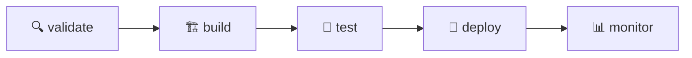

# 🦊 GitLab CI/CD - Sistema HITSS

## 🎯 Visão Geral

Pipeline completo de CI/CD configurado para o **GitLab da Global HITSS**, incluindo validação, build, testes, deploy e monitoramento automatizado.

## 🏗️ Arquitetura do Pipeline

### 📊 Stages do Pipeline


### 🔧 Jobs por Stage

#### 1. **🔍 VALIDATE** - Qualidade de Código
- **🔍 lint**: ESLint + Prettier
- **🔍 typescript**: Type checking
- **🔍 security**: Auditoria de segurança

#### 2. **🏗️ BUILD** - Construção
- **🏗️ build**: Build otimizado com Vite
- **📦 artifacts**: Artefatos para deploy

#### 3. **🧪 TEST** - Testes
- **🧪 unit-tests**: Testes unitários com coverage
- **🧪 integration-tests**: Testes de integração

#### 4. **🚀 DEPLOY** - Deploy
- **🚀 deploy-staging**: Deploy automático para staging
- **🚀 deploy-production**: Deploy manual para produção

#### 5. **📊 MONITOR** - Monitoramento
- **📊 health-check**: Verificação de saúde
- **📊 performance-test**: Testes de performance

## 🔐 Configuração de Variáveis e Secrets

### **Configuração no GitLab**

#### 1. **Acessar Configurações**
```
GitLab Project > Settings > CI/CD > Variables
```

#### 2. **Variáveis Obrigatórias**

| Variável | Valor | Tipo | Protegida | Mascarada |
|----------|-------|------|-----------|-----------|
| `VITE_SUPABASE_URL` | `https://seu-projeto.supabase.co` | Variable | ✅ | ❌ |
| `VITE_SUPABASE_ANON_KEY` | `sua-chave-publica` | Variable | ✅ | ✅ |
| `DOPPLER_TOKEN` | `dp.st.xxx` | Variable | ✅ | ✅ |

#### 3. **Variáveis Opcionais**

| Variável | Valor | Descrição |
|----------|-------|-----------|
| `DEPLOY_SERVER` | `https://servidor-deploy.com` | Servidor de deploy |
| `SLACK_WEBHOOK` | `https://hooks.slack.com/xxx` | Notificações Slack |
| `PERFORMANCE_THRESHOLD` | `90` | Score mínimo performance |

### **Script de Configuração Automática**

```bash
# Configurar variáveis via GitLab CLI
glab variable set VITE_SUPABASE_URL "https://seu-projeto.supabase.co" --protected
glab variable set VITE_SUPABASE_ANON_KEY "sua-chave" --protected --masked
glab variable set DOPPLER_TOKEN "dp.st.xxx" --protected --masked
```

## 🚀 Triggers e Regras

### **Execução Automática**
- ✅ **Push na main**: Pipeline completo
- ✅ **Merge Request**: Validação + Build + Testes
- ✅ **Push na develop**: Deploy staging
- ✅ **Schedule**: Backup noturno

### **Execução Manual**
- 🔴 **Deploy Production**: Aprovação manual obrigatória
- 🧹 **Clear Cache**: Limpeza de cache
- 📊 **Performance Tests**: Testes de performance

### **Regras de Proteção**
```yaml
# Deploy produção só com:
rules:
  - if: $CI_COMMIT_BRANCH == $CI_DEFAULT_BRANCH
    when: manual
  - if: $CI_COMMIT_TAG
    when: manual
```

## 📦 Gerenciamento de Artefatos

### **Estrutura de Artefatos**
```
artifacts/
├── dist/                 # Build da aplicação
├── coverage/             # Cobertura de testes
├── reports/              # Relatórios de qualidade
├── performance/          # Métricas de performance
└── security/            # Relatórios de segurança
```

### **Retenção de Artefatos**
- **Build**: 1 dia
- **Tests**: 1 semana  
- **Reports**: 1 semana
- **Performance**: 1 semana

## 🔄 Cache e Performance

### **Estratégia de Cache**
```yaml
cache:
  paths:
    - node_modules/
    - .pnpm-store/
  key:
    files:
      - pnpm-lock.yaml
```

### **Otimizações**
- ✅ **Cache inteligente**: Por lock file
- ✅ **Parallelização**: Jobs em paralelo
- ✅ **Build incremental**: Apenas mudanças
- ✅ **Artefatos compartilhados**: Entre stages

## 📊 Monitoramento e Métricas

### **Métricas Coletadas**
- ⏱️ **Tempo de Pipeline**: Duração total
- 📊 **Taxa de Sucesso**: % de pipelines bem-sucedidos
- 🐛 **Coverage**: Cobertura de testes
- ⚡ **Performance**: Score Lighthouse

### **Dashboards Disponíveis**
- 📈 **GitLab Analytics**: Métricas nativas
- 📊 **Custom Dashboards**: Métricas específicas
- 🔍 **Error Tracking**: Rastreamento de erros

## 🚨 Alertas e Notificações

### **Configuração de Notificações**
```yaml
# Webhook para Slack/Teams
📧 notify:
  script:
    - |
      curl -X POST $SLACK_WEBHOOK \
        -H 'Content-type: application/json' \
        --data '{
          "text": "Pipeline Status: $CI_JOB_STATUS",
          "channel": "#dev-hitss"
        }'
```

### **Tipos de Alertas**
- 🔴 **Pipeline Failed**: Falha no pipeline
- 🟡 **Tests Failed**: Falha nos testes
- 🟠 **Performance Drop**: Queda de performance
- 🔒 **Security Issues**: Problemas de segurança

## 🔧 Troubleshooting

### **Problemas Comuns**

#### 1. **Build Falha**
```bash
# Verificar logs
glab ci view

# Executar localmente
pnpm build

# Limpar cache
glab ci run --variable CLEAR_CACHE=true
```

#### 2. **Testes Falhando**
```bash
# Executar testes localmente
pnpm test

# Ver coverage
pnpm test --coverage

# Debug modo verbose
pnpm test --verbose
```

#### 3. **Deploy Falha**
```bash
# Verificar variáveis
glab variable list

# Testar conexão
curl -f $DEPLOY_SERVER/health

# Rollback manual
glab deployment rollback
```

### **Logs e Debug**
```bash
# Ver logs completos
glab ci trace JOB_ID

# Baixar artefatos
glab ci artifact JOB_ID

# Status do pipeline
glab ci status
```

## 📚 Scripts Úteis

### **package.json - Scripts GitLab**
```json
{
  "scripts": {
    "gitlab:validate": "pnpm lint && pnpm type-check",
    "gitlab:build": "doppler run -- pnpm build",
    "gitlab:test": "pnpm test --coverage",
    "gitlab:deploy": "echo 'Deploy via GitLab CI'"
  }
}
```

### **Comandos de Desenvolvimento**
```bash
# Simular pipeline localmente
pnpm gitlab:validate
pnpm gitlab:build
pnpm gitlab:test

# Push com trigger
git push gitlab main

# Criar MR
glab mr create --title "Feature XYZ"

# Ver status
glab ci view
```

## 🎯 Próximos Passos

### **Melhorias Planejadas**
1. **🔄 Integration Tests**: Mais cobertura
2. **📊 Monitoring**: Métricas avançadas  
3. **🔐 Security**: Scanners adicionais
4. **⚡ Performance**: Otimizações de build
5. **🚀 Deployment**: Estratégias blue/green

### **Configuração Adicional**
- [ ] Configurar servidor de deploy
- [ ] Integrar com monitoring (Datadog/New Relic)
- [ ] Configurar notificações Slack/Teams
- [ ] Implementar quality gates
- [ ] Configurar scheduled pipelines

## 📞 Suporte

Para problemas com CI/CD:
1. **Verificar logs** do pipeline
2. **Consultar documentação** GitLab
3. **Contatar equipe** DevOps Global HITSS
4. **Abrir issue** no repositório 