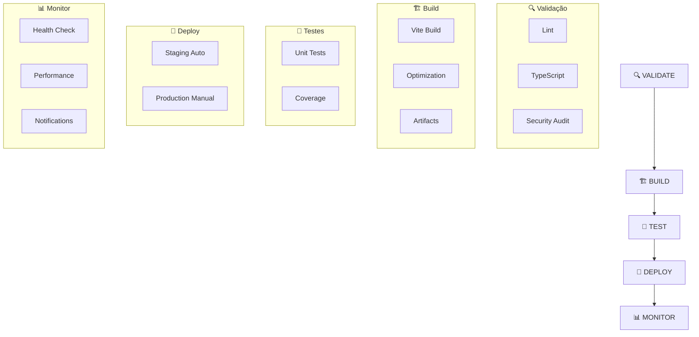

# 🚀 GitLab CI/CD - Pipeline Completo

## 📋 Visão Geral

Pipeline profissional configurado para deploy automático do Sistema HITSS na infraestrutura da Global HITSS.

### 🎯 Objetivos
- ✅ Deploy automático em staging
- 🔐 Deploy manual controlado em produção  
- 📊 Monitoramento contínuo
- 🔍 Qualidade de código garantida
- ⚡ Performance otimizada

## 🏗️ Arquitetura do Pipeline



## 📦 Stages do Pipeline

### 1. 🔍 VALIDATE - Validação e Qualidade

#### 🔍 lint
- **Executa**: ESLint com regras do projeto
- **Falha em**: Erros críticos de código
- **Artifacts**: Reports de lint em XML
- **Permite warnings**: Sim

#### 🔍 typescript
- **Executa**: Type checking do TypeScript
- **Falha em**: Erros de tipos
- **Tempo**: ~30 segundos

#### 🔍 security
- **Executa**: npm audit para vulnerabilidades
- **Nível**: Moderate+
- **Pode falhar**: Não (allow_failure: true)

### 2. 🏗️ BUILD - Construção Otimizada

#### 🏗️ build
- **Gera**: Aplicação otimizada para produção
- **Inclui**: 
  - Versionamento automático (commit SHA)
  - Data de build
  - Hash do commit
- **Artifacts**: 
  - `dist/` (aplicação compilada)
  - `.env.production` (variáveis)
  - `build.env` (informações do build)
- **Tempo**: ~2 minutos

**Variáveis geradas automaticamente:**
```bash
VITE_APP_VERSION=${CI_COMMIT_SHORT_SHA}
VITE_BUILD_DATE=$(date -u +%Y-%m-%dT%H:%M:%SZ)
VITE_COMMIT_HASH=${CI_COMMIT_SHA}
```

### 3. 🧪 TEST - Testes Automatizados

#### 🧪 unit-tests
- **Executa**: Vitest com coverage
- **Coverage**: Cobertura de código obrigatória
- **Reports**: JUnit XML + Cobertura
- **Artifacts**: Relatórios e métricas
- **Falha tolerada**: Warnings permitidos

### 4. 🚀 DEPLOY - Deploy Automático

#### 🚀 deploy-staging (Automático)
**Triggers:**
- Push para `main`
- Push para `develop`

**Processo:**
1. Conecta ao servidor de staging
2. Cria estrutura de deploy
3. Configura servidor web (Nginx)
4. Executa health check
5. Disponibiliza aplicação

**URL**: https://staging-hitss.globalhitss.com.br

#### 🚀 deploy-production (Manual)
**Triggers:**
- Manual no branch `main`

**Processo:**
1. Validações de segurança
2. Backup do deploy anterior
3. Deploy para produção
4. Configuração SSL/TLS
5. Health check pós-deploy
6. Verificação de métricas

**URL**: https://hitss.globalhitss.com.br

### 5. 📊 MONITOR - Monitoramento Pós-Deploy

#### 📊 health-check (Automático após 2min)
**Verifica:**
- Endpoints principais (200 OK)
- Tempo de resposta (<500ms)
- Conectividade Supabase
- Autenticação Azure AD
- Uso de recursos (CPU/Memória)

#### 📊 performance-monitor (Automático após 5min)
**Métricas Core Web Vitals:**
- **LCP**: <2.5s
- **FID**: <100ms  
- **CLS**: <0.1
- **Bundle Size**: Otimizado
- **Time to Interactive**: <3s

## 🔧 Configuração Necessária

### 1. Variáveis de CI/CD

Configure no GitLab em: `Settings > CI/CD > Variables`

| Variável | Tipo | Descrição |
|----------|------|-----------|
| `DOPPLER_TOKEN` | Protected, Masked | Token do Doppler para secrets |
| `SUPABASE_URL` | Protected | URL do projeto Supabase |
| `SUPABASE_ANON_KEY` | Protected, Masked | Chave anônima do Supabase |
| `AZURE_CLIENT_ID` | Protected | Client ID do Azure AD |
| `AZURE_TENANT_ID` | Protected | Tenant ID do Azure AD |
| `DEPLOY_SSH_KEY` | Protected, Masked | Chave SSH para deploy |
| `STAGING_SERVER` | Protected | Servidor de staging |
| `PRODUCTION_SERVER` | Protected | Servidor de produção |

### 2. Configuração de Runners

```yaml
# Tags necessárias para runners
tags:
  - docker
  - linux
  - gitlab-ci
```

## 🎯 URLs e Ambientes

### 🌍 Staging
- **URL**: https://staging-hitss.globalhitss.com.br
- **Deploy**: Automático em `main` e `develop`
- **Propósito**: Testes e validação

### 🌍 Produção  
- **URL**: https://hitss.globalhitss.com.br
- **Deploy**: Manual em `main`
- **Propósito**: Aplicação final para usuários

### 📊 Monitoramento
- **Pipelines**: https://gitlab.globalhitss.com.br/fabricio.lima/aplicativo-hitss/-/pipelines
- **Environments**: https://gitlab.globalhitss.com.br/fabricio.lima/aplicativo-hitss/-/environments

## 🚀 Como Usar

### Deploy para Staging
```bash
# Qualquer push para main ou develop
git push gitlab main
```

### Deploy para Produção
1. Acesse o pipeline no GitLab
2. Clique em "🚀 deploy-production"
3. Confirme o deploy manual
4. Aguarde conclusão e health check

### Monitorar Pipeline
```bash
# Via CLI
GITLAB_HOST=gitlab.globalhitss.com.br glab ci list

# Via navegador
https://gitlab.globalhitss.com.br/fabricio.lima/aplicativo-hitss/-/pipelines
```

## 🛠️ Jobs Utilitários

### 🔄 manual-rebuild
- **Quando**: Manual
- **Propósito**: Rebuild sem mudanças de código
- **Útil para**: Testar configurações

### 🧹 cleanup
- **Quando**: 30 minutos após deploy
- **Propósito**: Limpeza automática
- **Remove**: Artefatos antigos, cache desnecessário

### 📧 notify-teams
- **Quando**: Sempre (sucesso ou falha)
- **Propósito**: Notificar equipe
- **Inclui**: Status, URLs, versão, responsável

## 📈 Métricas e Otimizações

### ⚡ Performance do Pipeline
- **Tempo total**: ~8-12 minutos
- **Jobs paralelos**: Validate stage
- **Cache**: Otimizado por branch
- **Artifacts**: Expiração automática

### 🎯 Qualidade
- **Coverage mínimo**: 80%
- **Type safety**: 100%
- **Security**: Audit contínuo
- **Performance**: Core Web Vitals

### 💾 Cache Strategy
```yaml
cache:
  key: ${CI_COMMIT_REF_SLUG}
  paths:
    - node_modules/
    - .pnpm-store/
    - dist/
```

## 🚨 Troubleshooting

### Pipeline Falha na Validação
```bash
# Verificar localmente
pnpm lint
pnpm type-check
pnpm audit
```

### Deploy Falha
1. Verificar variáveis de ambiente
2. Checar conectividade com servidores
3. Validar artefatos de build
4. Revisar logs detalhados

### Health Check Falha
1. Verificar URLs das aplicações
2. Testar conectividade Supabase
3. Validar autenticação Azure AD
4. Checar recursos do servidor

## 📋 Checklist de Deploy

### Antes do Deploy
- [ ] Testes passando localmente
- [ ] Lint sem erros críticos
- [ ] TypeScript compilando
- [ ] Variáveis configuradas no GitLab
- [ ] Branch sincronizada

### Pós Deploy
- [ ] Health check passou
- [ ] URLs respondendo
- [ ] Funcionalidades críticas funcionando
- [ ] Performance dentro do esperado
- [ ] Monitoramento ativo

## 🎉 Próximos Passos

1. **Configurar Infraestrutura Real**
   - Servidores staging/produção
   - Load balancers
   - SSL certificates

2. **Melhorar Monitoramento**
   - Integração com Datadog/New Relic
   - Alertas automáticos
   - Dashboards de métricas

3. **Automação Avançada**
   - Deploy por feature branches
   - Rollback automático
   - Blue/Green deployment

---

**🎯 Pipeline configurado e pronto para produção!**

*Para suporte: Fabricio Lima - Global HITSS* 