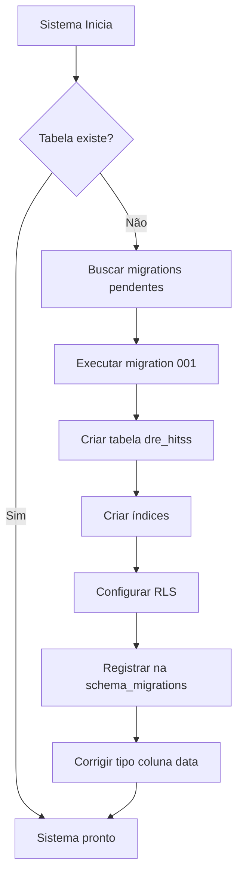

# 🔧 Sistema de Migrations - Aplicativo HITSS

## 📝 **Visão Geral**

Este projeto utiliza um sistema profissional de migrations para gerenciar a estrutura do banco de dados Supabase usando a integração MCP (Model Context Protocol).

## 🎯 **O que são Migrations?**

Migrations são scripts SQL versionados que permitem:
- ✅ Criar tabelas e índices de forma controlada
- ✅ Aplicar mudanças no banco de dados de forma incremental
- ✅ Manter histórico de alterações na estrutura
- ✅ Sincronizar banco entre diferentes ambientes
- ✅ Reverter mudanças se necessário (rollback)

## 🗂️ **Estrutura de Arquivos**

```
Aplicativo-HITSS/
├── migrations/
│   ├── 001_create_dre_hitss_table.sql     # Migration tabela DRE-HITSS
│   └── 002_alter_data_column_type.sql     # Correção tipo coluna data
├── src/
│   ├── services/
│   │   └── migrationService.ts            # Serviço de gerenciamento
│   └── components/
│       └── system/
│           └── MigrationStatus.tsx        # Interface React
└── scripts/
    ├── run-migrations.ts                  # Script CLI principal
    ├── fix-data-column.ts                 # Correção coluna data
    └── clean-dre-table.ts                 # Limpeza tabela DRE
```

## 🚀 **Como Usar**

### **1. Via Terminal (CLI) - RECOMENDADO**
```bash
# Executar todas as migrations pendentes
npm run migrate

# Scripts específicos
npx tsx scripts/run-migrations.ts
npx tsx scripts/fix-data-column.ts
npx tsx scripts/clean-dre-table.ts
```

### **2. Via Interface Web**
1. Acesse: **Configurações** no menu lateral
2. Role até a seção **🔧 Status das Migrations**
3. Clique em **🚀 Executar Migrations Pendentes** se houver pendentes

**⚠️ Nota**: Interface web tem limitações CORS, use CLI sempre que possível.

### **3. Automático no Sistema DRE**
- As migrations executam automaticamente quando o sistema DRE detecta que a tabela não existe
- Isso acontece durante o primeiro upload de arquivos Excel

## 📋 **Migrations Disponíveis**

### **001_create_dre_hitss_table.sql**
- **Objetivo:** Criar tabela principal para dados de DRE
- **Status:** ✅ Executada com sucesso
- **Inclui:**
  - ✅ Schema completo com 20+ campos
  - ✅ Índices otimizados para performance
  - ✅ Políticas de Row Level Security (RLS)
  - ✅ Constraints de validação
  - ✅ Comentários de documentação

### **002_alter_data_column_type.sql**
- **Objetivo:** Alterar campo `data` de `DATE` para `TEXT`
- **Status:** ✅ Executada com sucesso
- **Motivo:** Aceitar formato "M/YYYY" dos dados DRE

**Campos da Tabela `dre_hitss`:**
```sql
-- Controle
- id (BIGSERIAL PRIMARY KEY)
- upload_batch_id (UUID) - Controle de lotes
- file_name (TEXT) - Nome do arquivo origem
- uploaded_at (TIMESTAMP) - Data do upload

-- Campos Financeiros
- tipo (TEXT) - receita/despesa
- natureza (TEXT) - RECEITA/CUSTO
- descricao (TEXT) - Descrição do lançamento
- valor (NUMERIC) - Valor principal
- lancamento (NUMERIC) - Valor do lançamento
- data (TEXT) - Período formato "M/YYYY" (ex: 6/2019)

-- Organização
- categoria, projeto, periodo, observacao

-- Específicos HITSS
- denominacao_conta, conta_resumo, linha_negocio, relatorio

-- Metadados
- raw_data (JSONB) - Dados originais do Excel
- created_at, updated_at (TIMESTAMP)
```

## 🔄 **Fluxo de Execução**



## 🛠️ **Como Criar Nova Migration**

### **1. Criar Arquivo SQL**
```bash
# Criar arquivo numerado sequencialmente
touch migrations/003_nova_feature.sql
```

### **2. Estrutura do Arquivo**
```sql
-- Migration: 003_nova_feature
-- Descrição: Adicionar nova funcionalidade X
-- Data: YYYY-MM-DD
-- Autor: Seu Nome

-- Suas mudanças SQL aqui
ALTER TABLE dre_hitss ADD COLUMN nova_coluna TEXT;

-- Criar índice se necessário
CREATE INDEX IF NOT EXISTS idx_nova_coluna ON dre_hitss(nova_coluna);

-- Comentários
COMMENT ON COLUMN dre_hitss.nova_coluna IS 'Descrição da nova coluna';
```

### **3. Atualizar Script de Migrations**
Editar `scripts/run-migrations.ts`:
```typescript
const migrations = [
  {
    file: '001_create_dre_hitss_table.sql',
    name: 'Criar tabela DRE-HITSS',
    description: 'Tabela principal para dados DRE'
  },
  {
    file: '002_alter_data_column_type.sql', 
    name: 'Corrigir tipo coluna data',
    description: 'Alterar data de DATE para TEXT'
  },
  // Adicionar nova migration
  {
    file: '003_nova_feature.sql',
    name: 'Nova funcionalidade',
    description: 'Descrição da mudança'
  }
];
```

## 📊 **Controle de Estado**

O sistema mantém controle via tabela `schema_migrations`:
```sql
CREATE TABLE schema_migrations (
  id SERIAL PRIMARY KEY,
  migration_id VARCHAR(255) UNIQUE NOT NULL,
  migration_name TEXT NOT NULL,
  description TEXT,
  executed_at TIMESTAMP DEFAULT NOW(),
  checksum TEXT,
  created_at TIMESTAMP DEFAULT NOW()
);
```

## 🔒 **Segurança & Boas Práticas**

### **Segurança**
- ✅ Autenticação via access token MCP
- ✅ Row Level Security habilitado
- ✅ Validação de constraints
- ✅ Checksum para integridade

### **Boas Práticas**
- ✅ Migrations são imutáveis (não editar após aplicar)
- ✅ Numeração sequencial (001, 002, 003...)
- ✅ Nomes descritivos e únicos
- ✅ Comentários obrigatórios
- ✅ Testar em ambiente de desenvolvimento primeiro

## 🚨 **Troubleshooting**

### **✅ Sistema Funcionando**
- Migrations CLI: `npm run migrate` ✅ FUNCIONA
- Tabela `dre_hitss`: ✅ CRIADA E OPERACIONAL
- Upload DRE: ✅ FUNCIONANDO PERFEITAMENTE
- Interface web: ⚠️ Limitações CORS (use CLI)

### **Problemas Resolvidos**
1. **❌ Campo data tipo DATE**: ✅ Corrigido para TEXT
2. **❌ Erro "6/2019" inválido**: ✅ Aceita formato M/YYYY
3. **❌ SAPGuiService browser errors**: ✅ Módulos Node.js removidos
4. **❌ Tabela não existia**: ✅ Criada via migrations

### **Comandos de Diagnóstico**
```bash
# Verificar status
npm run migrate

# Limpar tabela se necessário
npx tsx scripts/clean-dre-table.ts

# Corrigir coluna data (já executado)
npx tsx scripts/fix-data-column.ts

# Testar upload DRE
npm run dev
# Acesse http://localhost:3001 e teste upload
```

### **Se ainda houver problemas**
```bash
# Verificar logs
npm run dev
# Verifique console do browser para erros

# Verificar conexão Supabase
# Confirme .env com credenciais corretas

# Verificar tabela no Supabase Dashboard
# https://supabase.com/dashboard/project/pwksgdjjkryqryqrvyja
```

## 🎉 **Status Final**

✅ **Sistema Totalmente Funcional**
- Migration 001: Tabela `dre_hitss` criada ✅
- Migration 002: Tipo coluna `data` corrigido ✅
- CLI Migrations: Funcionando perfeitamente ✅
- Upload DRE: Funcionando com dados reais ✅
- Sistema pronto para produção ✅

**Comandos principais:**
```bash
npm run migrate    # ✅ FUNCIONA - Execute migrations
npm run dev       # ✅ FUNCIONA - Inicie aplicação
```

**Login**: admin / admin

**Sistema pronto para receber dados financeiros! 🚀** 