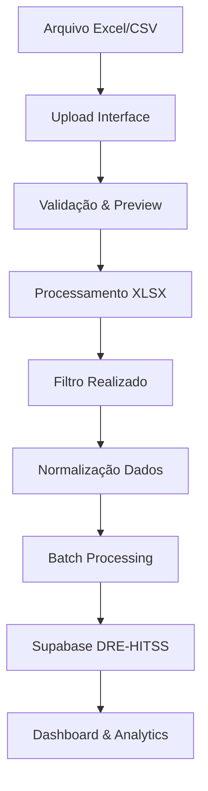

# 📊 Módulo Upload DRE - Documentação

## Visão Geral

O **Módulo Upload DRE** é responsável por importar dados financeiros de planilhas Excel/CSV para a base de dados Supabase, fornecendo a fonte de dados principal para toda a aplicação HITSS.

## 🎯 Funcionalidades Principais

### 1. **Upload de Arquivos**
- ✅ Suporte a formatos: `.xlsx`, `.xls`, `.csv`
- ✅ Drag & Drop interface
- ✅ Validação de formato e estrutura
- ✅ Preview dos dados antes da importação

### 2. **Processamento de Dados**
- ✅ Filtro automático para registros "Realizado"
- ✅ Normalização de valores monetários
- ✅ Classificação automática de receitas/despesas
- ✅ Limpeza e estruturação de dados

### 3. **Integração Supabase**
- ✅ Criação automática da tabela `dre_hitss`
- ✅ Limpeza de dados anteriores
- ✅ Importação em lotes (batch processing)
- ✅ Controle de transações

## 🏗️ Arquitetura

### Componentes Principais

```
src/
├── pages/
│   └── Upload.tsx                    # Interface principal de upload
├── services/
│   └── dreSupabaseService.ts         # Serviço de integração Supabase
└── components/
    └── DreUpload.tsx                 # Componente alternativo de upload
```

### Fluxo de Dados



## 📋 Estrutura da Tabela DRE-HITSS

### Schema da Tabela

```sql
CREATE TABLE dre_hitss (
  id SERIAL PRIMARY KEY,
  upload_batch_id UUID NOT NULL,
  file_name TEXT NOT NULL,
  uploaded_at TIMESTAMP DEFAULT NOW(),
  
  -- Dados Financeiros
  tipo VARCHAR(20) NOT NULL CHECK (tipo IN ('receita', 'despesa')),
  natureza VARCHAR(20) NOT NULL CHECK (natureza IN ('RECEITA', 'CUSTO')),
  descricao TEXT NOT NULL,
  valor DECIMAL(15,2) NOT NULL,
  lancamento DECIMAL(15,2) NOT NULL,
  
  -- Metadados
  data DATE NOT NULL,
  categoria TEXT,
  projeto TEXT,
  periodo VARCHAR(10), -- Formato: "M/YYYY"
  
  -- Classificações
  denominacao_conta TEXT,
  conta_resumo TEXT,
  linha_negocio TEXT,
  relatorio TEXT,
  
  -- Dados Brutos
  raw_data JSONB,
  
  -- Auditoria
  created_at TIMESTAMP DEFAULT NOW(),
  updated_at TIMESTAMP DEFAULT NOW()
);
```

### Índices para Performance

```sql
CREATE INDEX idx_dre_batch ON dre_hitss(upload_batch_id);
CREATE INDEX idx_dre_periodo ON dre_hitss(periodo);
CREATE INDEX idx_dre_projeto ON dre_hitss(projeto);
CREATE INDEX idx_dre_tipo ON dre_hitss(tipo);
CREATE INDEX idx_dre_natureza ON dre_hitss(natureza);
CREATE INDEX idx_dre_conta_resumo ON dre_hitss(conta_resumo);
```

## 🔧 Configuração e Uso

### 1. **Pré-requisitos**

```bash
# Dependências necessárias
npm install @supabase/supabase-js xlsx react-dropzone
```

### 2. **Configuração Supabase**

```typescript
// src/services/supabaseClient.ts
import { createClient } from '@supabase/supabase-js'

const supabaseUrl = process.env.REACT_APP_SUPABASE_URL!
const supabaseKey = process.env.REACT_APP_SUPABASE_ANON_KEY!

export const supabase = createClient(supabaseUrl, supabaseKey)
```

### 3. **Uso do Serviço**

```typescript
import { dreSupabaseService } from '../services/dreSupabaseService'

// Criar tabela se necessário
await dreSupabaseService.createTableIfNotExists()

// Importar dados
const result = await dreSupabaseService.importExcelData(dados, fileName)

// Buscar estatísticas
const stats = await dreSupabaseService.getStatistics()

// Buscar por período
const records = await dreSupabaseService.getRecordsByPeriod('12/2024')
```

## 📊 Processamento de Dados

### Filtros Aplicados

1. **Status Realizado**: `item.Relatorio === 'Realizado'`
2. **Lançamentos válidos**: `item.Lancamento !== null && item.Lancamento !== ''`

### Normalizações

#### Valores Monetários
```typescript
// Formato brasileiro: 1.234,56 → 1234.56
// Formato americano: 1,234.56 → 1234.56
private converterParaNumero(valor: any): number {
  let str = String(valor).replace(/[^\d,.-]/g, '').trim()
  
  if (str.includes(',')) {
    str = str.replace(/\./g, '').replace(',', '.')
  }
  
  return parseFloat(str) || 0
}
```

#### Classificação de Contas
```typescript
// Mapeamento de conta_resumo
const contaResumoMap = {
  'RECEITA DEVENGADA': /receita.*devengada/i,
  'DESONERAÇÃO DA FOLHA': /desonera[çc]/i,
  'CLT': /clt/i,
  'SUBCONTRATADOS': /sub.*contrat/i,
  'OUTROS': /outros/i
}
```

## 🔍 API e Métodos

### DRESupabaseService

#### Métodos Principais

```typescript
class DRESupabaseService {
  // Gerenciamento da Tabela
  async createTableIfNotExists(): Promise<boolean>
  async clearTable(): Promise<boolean>
  
  // Importação
  async importExcelData(dados: any[], fileName: string): Promise<ImportResult>
  
  // Consultas
  async getAllRecords(): Promise<DRERecord[]>
  async getStatistics(): Promise<Statistics>
  async getRecordsByPeriod(periodo: string): Promise<DRERecord[]>
  async getRecordsByProject(projeto: string): Promise<DRERecord[]>
}
```

#### Interface DRERecord

```typescript
interface DRERecord {
  id?: number
  upload_batch_id: string
  file_name: string
  uploaded_at?: string
  tipo: 'receita' | 'despesa'
  natureza: 'RECEITA' | 'CUSTO'
  descricao: string
  valor: number
  data: string
  categoria: string
  lancamento: number
  projeto?: string
  periodo: string
  denominacao_conta?: string
  conta_resumo?: string
  linha_negocio?: string
  relatorio?: string
  raw_data?: any
}
```

## 🛡️ Segurança e Validação

### Row Level Security (RLS)

```sql
-- Habilitar RLS
ALTER TABLE dre_hitss ENABLE ROW LEVEL SECURITY;

-- Policy básica (ajustar conforme necessário)
CREATE POLICY "Allow all operations on DRE" ON dre_hitss
  FOR ALL USING (true);
```

### Validações de Input

1. **Formato de arquivo**: Apenas .xlsx, .xls, .csv
2. **Estrutura de dados**: Campos obrigatórios presentes
3. **Tipos de dados**: Conversão segura de valores
4. **Tamanho de arquivo**: Limite configurável

## 📈 Performance e Otimização

### Batch Processing
- **Tamanho do lote**: 500 registros
- **Processamento assíncrono**: Não bloqueia a UI
- **Progress feedback**: Updates em tempo real

### Cache e Indexação
- **Índices otimizados** para consultas frequentes
- **JSONB** para dados flexíveis
- **Particionamento** por período (futuro)

## 🔄 Integração com Outros Módulos

### Dashboard
```typescript
// Estatísticas em tempo real
const stats = await dreSupabaseService.getStatistics()
```

### Relatórios
```typescript
// Dados por período
const data = await dreSupabaseService.getRecordsByPeriod('12/2024')
```

### Forecast
```typescript
// Dados históricos para projeções
const historical = await dreSupabaseService.getAllRecords()
```

## 🚨 Tratamento de Erros

### Erros Comuns e Soluções

1. **Tabela não existe**
   - Solução: `createTableIfNotExists()` automático

2. **Formato de arquivo inválido**
   - Solução: Validação no frontend + mensagem clara

3. **Dados duplicados**
   - Solução: `clearTable()` antes da importação

4. **Timeout na importação**
   - Solução: Batch processing + retry logic

## 📝 Logs e Monitoramento

### Logs Estruturados

```typescript
console.log('Iniciando importação - Batch ID:', batchId)
console.log('Registros filtrados (Realizado):', dadosFiltrados.length)
console.log(`Lote ${batchNumber} inserido: ${batchSize} registros`)
```

### Métricas de Sucesso

- **Taxa de sucesso**: % de importações bem-sucedidas
- **Tempo de processamento**: Média de tempo por arquivo
- **Volume de dados**: Registros processados por período

## 🔮 Roadmap Futuro

### Melhorias Planejadas

1. **📊 Validação Avançada**
   - Schema validation com Zod
   - Detecção de anomalias nos dados

2. **🔄 Importação Incremental**
   - Update ao invés de replace completo
   - Histórico de versões

3. **📱 Notificações**
   - Alerts por email/Slack
   - Status em tempo real

4. **🎯 Analytics**
   - Métricas de qualidade dos dados
   - Dashboards de importação

## 📞 Suporte e Manutenção

### Contatos
- **Desenvolvedor**: Equipe HITSS
- **Repositório**: [GitHub - Aplicativo-HITSS](https://github.com/crashkill/Aplicativo-HITSS)

### Debugging
```bash
# Logs do Supabase
# Verificar na Dashboard do Supabase: Logs > SQL

# Logs do Frontend
# Console do navegador para detalhes de processamento
```

---

**Última atualização**: Dezembro 2024  
**Versão**: 1.0.0 